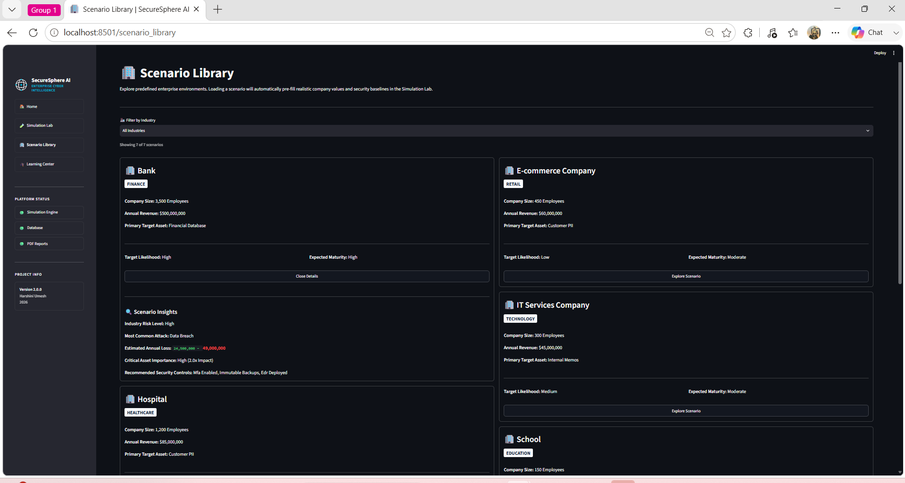
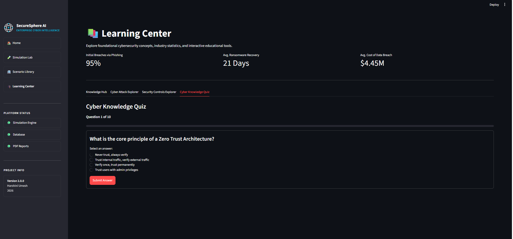
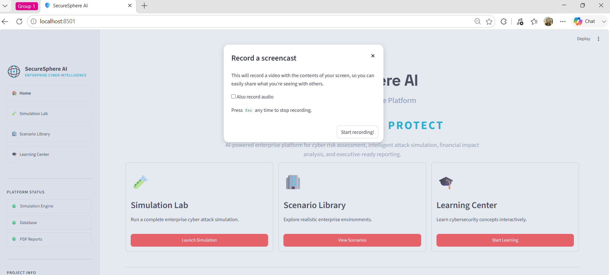

<div align="center">

  

  # SecureSphere AI

  ### Enterprise Cyber Risk Intelligence Platform

  **Predict • Simulate • Protect**

  SecureSphere AI is an end-to-end cyber risk intelligence and assessment platform designed for modern enterprises. Built with Python and Streamlit, it enables security teams and decision-makers to simulate sophisticated cyber attacks, evaluate defense posture, quantify business impact, and deliver executive-grade reporting in real time.

  [](https://www.python.org/)
  [](https://streamlit.io/)
  [](https://www.sqlite.org/)
  [](LICENSE)
  [](https://github.com/harshiniumesh/SecureSphere-AI/stargazers)
  [](https://github.com/harshiniumesh/SecureSphere-AI/network/members)
  [](https://github.com/harshiniumesh/SecureSphere-AI/issues)

</div>

---

## 📋 Project Overview

Modern cyber threats demand proactive defense and precise impact quantification. **SecureSphere AI** bridges the gap between technical security assessments and high-level executive decision-making. By uniting continuous risk scoring, threat simulation, security control auditing, and educational resources into a unified interface, SecureSphere AI empowers organizations to stay ahead of evolving attack vectors.

### Core Capabilities
* 🛡️ **Simulate Cyber Attacks:** Test organizational resilience against dynamic phishing, ransomware, and social engineering scenarios.
* 📊 **Assess Cyber Resilience:** Gauge posture across multiple business units with centralized metrics.
* 💰 **Estimate Business Impact:** Quantify potential financial loss and operational downtime prior to incident occurrence.
* ⚙️ **Evaluate Security Controls:** Measure compliance and effectiveness across technical, administrative, and physical safeguards.
* 📈 **Generate Executive Insights:** Export standardized, C-suite ready PDF risk intelligence reports instantly.
* 🎓 **Cybersecurity Learning Center:** Train team members using built-in interactive learning modules and knowledge quizzes.

---

## ✨ Features

* **Interactive Simulation Lab** — Run real-time threat propagation models to visualize exposure, attack paths, and defense efficacy.
* **Enterprise Scenario Library** — Access a pre-configured library of industry-standard threat vectors and breach conditions.
* **Cybersecurity Learning Center** — Educate users through dedicated modules, practice quizzes, and tracking tools.
* **Dynamic Risk Scoring** — Real-time mathematical scoring matrix evaluating likelihood, impact, and existing mitigations.
* **Security Control Assessment** — Automated gap analysis across essential control frameworks.
* **Executive Dashboard** — Dual Light/Dark themed interface providing high-level KPI tracking, trend analyses, and system metrics.
* **Automated PDF Report Generation** — Compile comprehensive risk audits into actionable executive PDFs with a single click.
* **Persistent SQLite Data Store** — Lightweight, embedded database ensuring continuous tracking of scores, logs, and user records.
* **Responsive Streamlit UI** — Modern, accessible frontend optimized for interactive analytics across all device screen sizes.
* **Modular Code Architecture** — Scalable Python design built for seamlessly plugging in custom threat feeds or models.

---

## 🖼️ Screenshots

<details open>
<summary><b>1. Home Dashboard (Light & Dark Themes)</b></summary>
<br/>

| Light Theme | Dark Theme |
| :---: | :---: |
|  |  |

</details>

<details>
<summary><b>2. Simulation Lab & Executive Reporting</b></summary>
<br/>

| Dark Theme Simulation | Report Generation & PDF Download |
| :---: | :---: |
|  |  |

</details>

<details>
<summary><b>3. Scenario Library & Learning Center</b></summary>
<br/>

| Scenario Library | Learning Center |
| :---: | :---: |
|  |  |

</details>

<details>
<summary><b>4. Knowledge Quizzes & Performance Records</b></summary>
<br/>

| Interactive Quiz Module | Performance Records |
| :---: | :---: |
|  |  |

</details>

---

## 🛠️ Technology Stack

| Category | Technology / Library |
| :--- | :--- |
| **Programming Language** | Python 3.10+ |
| **Frontend Framework** | Streamlit |
| **Database Engine** | SQLite3 |
| **Data Processing & Analytics**| Pandas, NumPy |
| **Visualization & Styling** | Plotly, Matplotlib, Custom CSS / UI Themes |
| **Reporting Engine** | ReportLab / PyPDF2 (PDF Export Engine) |
| **System Architecture** | Modular Controller-Service Design |

---

## 📁 Folder Structure

```text
SecureSphere-AI/
├── assets/
│   ├── logo.svg
│   ├── 1.light theme dashboard.png
│   ├── 2.light theme dashboard.png
│   ├── 3.dark theme dashboard.png
│   ├── 4.simulation lab.dark theme.png
│   ├── 5.simulation lab.downloading report.png
│   ├── 6.library.png
│   ├── 7.learning center.png
│   ├── 8.lc.png
│   ├── 9.lc.png
│   ├── 10.quiz.png
│   ├── 11.Q.crct.png
│   ├── 12.Q.wrong.png
│   ├── 13.total score.png
│   ├── 14.record.png
│   └── SecureSphere_Phishing.pdf
├── data/
│   └── securesphere.db
├── modules/
│   ├── dashboard.py
│   ├── simulation.py
│   ├── library.py
│   ├── learning.py
│   └── report_generator.py
├── app.py
├── config.py
├── requirements.txt
├── LICENSE
└── README.md
